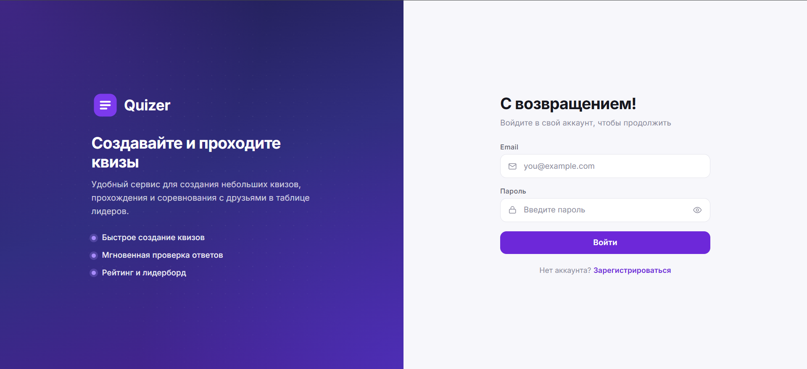
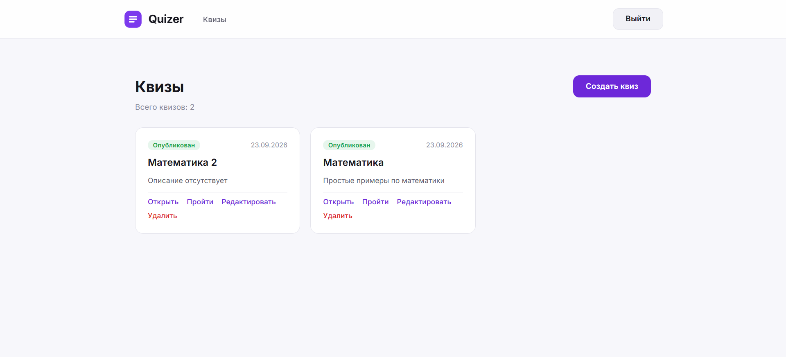

# Quizer

Сервис по созданию и прохождению небольших квизов.

**Quizer** — это веб-приложение, позволяющее создавать собственные квизы (викторины), наполнять их вопросами и вариантами ответов, публиковать их и проходить другим пользователям. По итогам прохождения формируется результат и таблица лидеров.



---

## Возможности

- **Регистрация и авторизация** пользователей.
- **Создание и редактирование квизов**.
- **Управление вопросами** трёх типов:
  - с открытым ответом;
  - с одним вариантом ответа;
  - с несколькими вариантами ответа.
- **Публикация квиза**.
- **Прохождение квиза** с сохранением ответов на каждый вопрос и возможностью вернуться к незавершённой попытке.
- **Результат прохождения** с подсчётом набранных баллов.
- **Таблица лидеров** по каждому квизу.



---

## Технологический стек

### Бэкенд

Платформа: .NET 10 + ASP.NET Core Web API

Архитектура: Clean Architecture + DDD + CQRS

БД: EF Core + Npgsql + ASP.NET Core Identity

### Фронтенд
 
Платформа: Vite + React 19 + TypeScript

Архитектура: SPA

---

## Запуск проекта

### Предварительные требования

- [.NET 10 SDK](https://dotnet.microsoft.com/download/dotnet/10.0)
- [Node.js](https://nodejs.org/) (для фронтенда)
- [PostgreSQL](https://www.postgresql.org/)

### 1. Клонирование репозитория

```bash
git clone https://github.com/DmitriyAlexv/Quizer.git
cd Quizer
```

### 2. Настройка бэкенда

Установите переменные **User Secrets** (или заполните `appsettings.json`) для строк подключения и ключа JWT.

```bash
cd back/src/Quizer.Web
dotnet user-secrets set "App:DbConnectionString" "Host=localhost;Port=5432;Database=quizer;Username=postgres;Password=your_password"
dotnet user-secrets set "App:IdentityDbConnectionString" "Host=localhost;Port=5432;Database=quizer_identity;Username=postgres;Password=your_password"
dotnet user-secrets set "Jwt:SecretKey" "your-super-secret-key"
```

> Параметры конфигурации описаны в [`appsettings.json`](back/src/Quizer.Web/appsettings.json).

### 3. Применение миграций

Примените миграции для двух контекстов БД (основного и Identity):

```bash
dotnet ef database update -p src/Quizer.Infrastructure -s src/Quizer.Web -c QuizerDbContext
dotnet ef database update -p src/Quizer.Infrastructure -s src/Quizer.Web -c QuizerIdentityDbContext
```

### 4. Сборка и запуск бэкенда

```bash
dotnet build
dotnet run -c Release
```

Бэкенд будет доступен по адресу `http://localhost:5097` (профиль `http`), Swagger — по адресу `http://localhost:5097/swagger`.

### 5. Запуск фронтенда

```bash
cd front
npm install
npm run dev
```

Фронтенд по умолчанию обращается к `http://localhost:5097`. При необходимости задайте базовый URL через переменную окружения `VITE_API_URL` (см. [`front/.env.example`](front/.env.example)).

---

## Тесты

Запуск unit-тестов:

```bash
dotnet test
```

---

## API

Документация API доступна в **Swagger UI** после запуска бэкенда: `http://localhost:5097/swagger`.

Все эндпоинты, кроме регистрации и авторизации, требуют JWT-токен в заголовке `Authorization: Bearer <token>`.

---

## Структура репозитория

```
.
├── back/            # Бэкенд (.NET 10)
├── front/           # Фронтенд (React + TypeScript)
├── CHANGELOG.md     # История изменений
├── LICENSE          # Лицензия (MIT)
└── README.md        # Этот файл
```

---

## Лицензия

Проект распространяется под лицензией [MIT](LICENSE).
